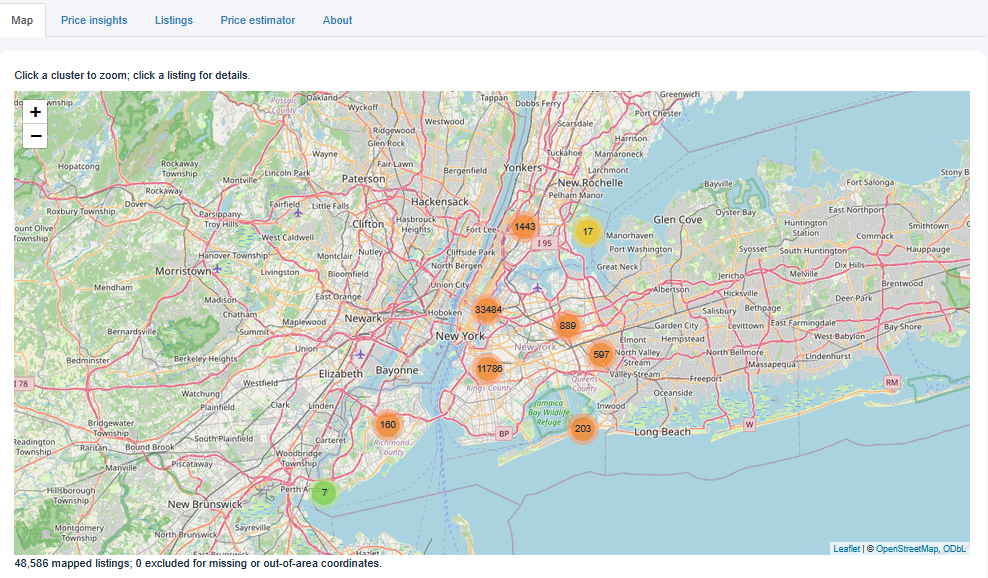
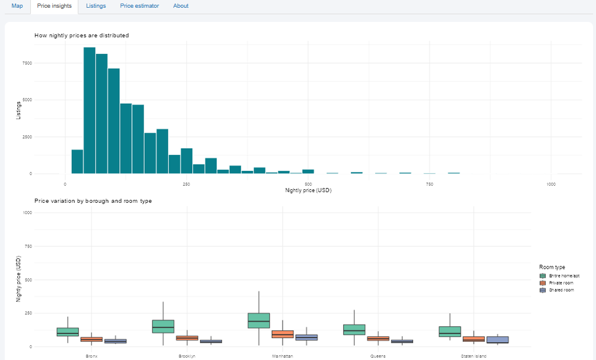

# NYC Airbnb Explorer

An interactive R Shiny dashboard for exploring historical NYC Airbnb listings through maps, filters, price comparisons, and regression-based price estimation.

Created by **Tobi Adenola**.

## Dashboard preview

### Listing map


### Price insights


## Features

- Interactive Leaflet map with clustered listings and clickable details
- Filters for borough, neighbourhood, room type, nightly price, and minimum stay
- Listing-title search
- Summary cards showing listing count, median price, and neighbourhood count
- Price distributions and comparisons by borough and room type
- Searchable listings table
- Downloadable filtered data
- Regression-based nightly price estimator with a prediction interval

## Tools

R, Shiny, Leaflet, ggplot2, and DT.

## Run locally

Download or clone this repository, then install the required packages:

```r
install.packages(c("shiny", "leaflet", "ggplot2", "DT"))
```

Open `app.R` in RStudio and click **Run App**.

Alternatively, from the directory containing the repository folder:

```r
shiny::runApp("nyc-airbnb-shiny-dashboard")
```

Requires R 4.1 or later. An internet connection is needed for map tiles. No Mapbox API key is required.

## Data and preparation

The included `data/AB_NYC.csv` contains 48,895 historical NYC Airbnb listings from 2019.

Following the original analysis:
- Listings with prices above $0 and below $1,000 are retained.
- The cleaned dataset contains 48,586 listings.
- Missing reviews per month are replaced with zero.
- Missing review dates remain missing.

This dashboard uses a historical snapshot. Prices and availability do not represent current booking conditions.

## Price estimator

The estimator uses the regression formula:

```r
log(price) ~ room_type + neighbourhood_group + reviews_per_month
```

The model is fitted to the complete cleaned dataset and does not change with dashboard filters.

Exponentiating the predicted log price produces an estimate of conditional median nightly price. The app also displays a transformed 95% prediction interval.

The model describes historical associations. No held-out predictive accuracy is claimed.

## Relationship to the original project

This dashboard builds on my [NYC Airbnb Predictive Analytics project](https://github.com/adenolatobi/nyc-airbnb-predictive-analytics).

The original project focuses on statistical analysis and modeling. This repository focuses on making the data and regression accessible through an interactive application.

## Validation and status

The app was launched successfully in RStudio by the author. Dataset checks confirmed the cleaning counts and independently reproduced the regression’s adjusted R-squared of approximately 0.483.

The app currently runs locally and has not been deployed online.

## Author

**Tobi Adenola**

- [GitHub](https://github.com/adenolatobi)
- [Portfolio](https://tobiadenola.com)
